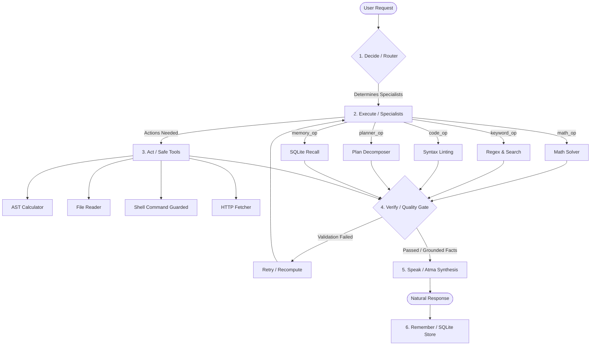

# Colony of Minds AI

[](LICENSE)
[](pyproject.toml)

A hardware-efficient, cooperative AI operator framework and custom small language model (AtmaCore) designed to run efficiently on low-resource environments (e.g., **1 GB RAM, 2-core CPU, no GPU**). 

The core philosophy is that **intelligence comes from composition and orchestration of specialized parts, not from a single giant model.**

---

## ⚖️ Why Colony of Minds? (Positioning)

The AI agent space is crowded with frameworks like **AutoGPT**, **CrewAI**, and **LangGraph**. However, Colony of Minds approaches agentic workflows differently:

| Feature / Goal | Standard Agent Frameworks (CrewAI, LangGraph) | Colony of Minds AI |
| :--- | :--- | :--- |
| **Orchestration Model** | Sequential or Graph LLM-based reasoning calls | Hybrid deterministic Routing + symbolic Execution |
| **Resource Constraints** | Heavy parameters, requires multiple APIs/GPUs | Runs fully local on **1 GB RAM & 2-core CPU** |
| **Hallucination Prevention** | Relies on LLM self-correction or prompt rules | Strict **Verifier Gate** (independent AST math, schema checks) |
| **LLM Dependency** | LLM handles reasoning, memory, tools, and output | LLM (AtmaCore) is only used for **natural output verbalization** |
| **Inference Footprint** | Gigabytes of RAM / expensive cloud APIs | Under **150 MB memory** for the core pipeline |

### The Core Difference:
* **No Unnecessary LLMs**: Most agent frameworks use large models to decide, execute, and verify. Colony uses symbolic, deterministic code (Python/Regex/SQL) for routing and specialist tasks. The LLM is **only** used at the very end to format verified facts into natural text.
* **Grounded Verifier**: Instead of hoping the model follows instructions, our Verifier intercepts all outputs and checks them against strict schemas, AST validation rules, and contradiction checks before speaking.

---

## 🧬 Core Architecture Concept

The Colony behaves like a digital organism, composed of specialized components cooperating to solve complex queries:



1. **Sense**: Accepts user prompts.
2. **Decide (Router)**: Resolves the prompt to the most capable suboperators.
3. **Execute (Suboperators)**: Deterministic, symbolic, or lightweight code modules execute specialized reasoning.
4. **Act (Tools)**: Executes safe filesystem, arithmetic, or network commands under safety gate confirmations.
5. **Verify (Verifier)**: A strict validation layer that blocks hallucinations, checks schema compliance, recalculates AST math, and detects contradictions.
6. **Speak (Atma)**: Verbalizes only verified, grounded facts into a natural answer using either strict templates or a tiny model.
7. **Remember (Memory)**: Stores interactions and updated preferences in local SQLite.
8. **Evaluate (Benchmark)**: Regularly tests correctness, latencies, and RAM usage against evaluation datasets.

---

## 📂 Repository Structure

The project is split into two main sections:

*   [**`maincode/`**](file:///D:/GitHub/colony_of_minds_phases/maincode): The active, executable Python implementation.
    *   [`colony_ai/`](file:///D:/GitHub/colony_of_minds_phases/maincode/colony_ai): Core operator-suboperator pipeline, verifier, tools, templates, and integration benchmarks.
    *   [`atmacore/`](file:///D:/GitHub/colony_of_minds_phases/maincode/atmacore): Custom transformer model design, BPE tokenizer trainer, dataset generator, and low-resource PyTorch training loops.
*   [**`plans/`**](file:///D:/GitHub/colony_of_minds_phases/plans): The complete, 32-phase master architectural roadmap detailing the scientific, technical, and commercial evolution of the project.

---

## 🚦 Phase Completion Status

Below is the completion status of the project's development phases:

### 🟢 Completed & Code-Verified (Phases 1-10 & 13-17)

| Phase | Title | Description | Code Location | Status |
| :--- | :--- | :--- | :--- | :--- |
| **Phase 1** | Foundation | Project skeleton, communication schemas, CLI run pipeline. | [colony_ai/](file:///D:/GitHub/colony_of_minds_phases/maincode/colony_ai) | ✅ DONE |
| **Phase 2** | Router | Keyword, intent, and confidence-driven routing orchestration. | [router.py](file:///D:/GitHub/colony_of_minds_phases/maincode/colony_ai/colony/router.py) | ✅ DONE |
| **Phase 3** | Suboperators | Deterministic specialists (math, keyword matching, linting, planning). | [suboperators/](file:///D:/GitHub/colony_of_minds_phases/maincode/colony_ai/suboperators) | ✅ DONE |
| **Phase 4** | Verifier | AST recheck, schema validator, contradiction & missing-facts gate. | [verifier.py](file:///D:/GitHub/colony_of_minds_phases/maincode/colony_ai/colony/verifier.py) | ✅ DONE |
| **Phase 5** | Template Atma | LLM-less natural formatting using deterministic templates. | [atma.py](file:///D:/GitHub/colony_of_minds_phases/maincode/colony_ai/colony/atma.py) | ✅ DONE |
| **Phase 6** | Tiny Model Atma | Ollama/GGUF local tiny model adapter for natural synthesis. | [atma.py](file:///D:/GitHub/colony_of_minds_phases/maincode/colony_ai/colony/atma.py) | ✅ DONE |
| **Phase 7** | Memory | Persistent SQLite storage for logging history & learning facts. | [memory/](file:///D:/GitHub/colony_of_minds_phases/maincode/colony_ai/memory) | ✅ DONE |
| **Phase 8** | Safe Tools | Controlled calculator, shell commands, file operations, web fetch. | [tools.py](file:///D:/GitHub/colony_of_minds_phases/maincode/colony_ai/colony/tools.py) | ✅ DONE |
| **Phase 9** | Parallelism | Lazy-loading packages and concurrent ThreadPool execution (cap=2). | [run_colony.py](file:///D:/GitHub/colony_of_minds_phases/maincode/colony_ai/run_colony.py) | ✅ DONE |
| **Phase 10** | Evaluation | 50-prompt benchmark dataset, accuracy metrics, and stress-tests. | [tests/](file:///D:/GitHub/colony_of_minds_phases/maincode/colony_ai/tests) | ✅ DONE |
| **Phase 13** | Concept | Mathematical rationale for custom tiny models vs parameter scaling. | [plans/13...](file:///D:/GitHub/colony_of_minds_phases/plans/13_why_custom_model.md) | ✅ DONE |
| **Phase 14** | Model Architecture | Custom transformer with GQA, sliding window masking, MoE, fact-bias. | [atmacore/model.py](file:///D:/GitHub/colony_of_minds_phases/maincode/atmacore/model.py) | ✅ DONE |
| **Phase 15** | Tokenizer | Hugging Face BPE trainer with dual natural + JSON splitting. | [atmacore/tokenizer.py](file:///D:/GitHub/colony_of_minds_phases/maincode/atmacore/tokenizer.py) | ✅ DONE |
| **Phase 16** | Data Strategy | Synthetic dataset generator mapping prompt-facts-target pairs. | [atmacore/data_generator.py](file:///D:/GitHub/colony_of_minds_phases/maincode/atmacore/data_generator.py) | ✅ DONE |
| **Phase 17** | Training Loop | PyTorch trainer with Mixed Precision (AMP) and gradient accumulation. | [atmacore/train.py](file:///D:/GitHub/colony_of_minds_phases/maincode/atmacore/train.py) | ✅ DONE |

### 🟡 Active / Partial Integration (Phases 11 & 30-32)

*   **Phase 11: Productization**: CLI wrappers and `pyproject.toml` package build scripts are ready. Local HTTP and web operators are in draft.
*   **Phase 30: Open-Source Strategy**: Currently establishing this repository for public collaboration, drafting licenses, and code-conduct parameters.
*   **Phase 32: Next Steps**: Synthesizing feedback datasets for initial pre-training.

### 🔵 Future Milestones (Phases 18-29 Roadmap)

These phases exist in the [`plans/`](file:///D:/GitHub/colony_of_minds_phases/plans) directory as concrete blueprints to be implemented next:

*   **Phase 18-19**: Knowledge Distillation and Preference Training (DPO).
*   **Phase 20-21**: Grammar-Constrained generation and continuous feedback adaptation.
*   **Phase 22-24**: Optimized CPU Inference Engine, custom LoRA adapter layers, and safety alignment.
*   **Phase 26-29**: Memory-augmented inference, model pruning/quantization, and edge deployment (Raspberry Pi).

---

## 🚀 Getting Started

### 1. Installation

Clone this repository and install it in editable mode (virtual environment recommended):

```bash
# Clone the repository
git clone https://github.com/your-username/colony-of-minds-phases.git
cd colony-of-minds-phases/maincode

# Create a virtual environment
python -m venv .venv
source .venv/bin/activate  # On Windows: .venv\Scripts\activate

# Install dependencies and package
pip install -e .[dev]
```

*Note: For training the custom model, make sure to install PyTorch matching your platform (e.g. `pip install torch`).*

### 2. Running the Colony CLI Operator

Test the system integration end-to-end:

```bash
# Run a single query through the routing and verification pipeline
colony-run "calculate 23 * 45"

# Run the interactive operator shell
colony-cli
```

### 3. Running the Benchmark and Stress Tests

Verify framework performance constraints:

```bash
# Run standard unit tests
python -m unittest discover -s colony_ai/tests -p "test_*.py"

# Run the 50-prompt evaluation benchmark suite
python colony_ai/tests/run_benchmarks.py

# Run memory and concurrency stress tests
python colony_ai/tests/stress_test.py
```

### 4. Custom AtmaCore Model Workspace

To experiment with BPE tokenizer training, dataset compilation, and neural model training:

```bash
# Generate synthetic dataset
python atmacore/data_generator.py

# Train the tokenizer
python atmacore/tokenizer_trainer.py

# Run a training epoch on generated data
python atmacore/train.py

# Run unit tests verifying shapes, positions, GQA attention, and MoE routing
python -m unittest discover -s atmacore/tests -p "test_*.py"
```

---

## 🤝 Contribution Guidelines

We are building a new concept for ultra-efficient, low-resource AI. Contributions to improve deterministic suboperators, optimize PyTorch training mechanics, or enhance the verifier safety boundaries are highly welcome.

For details on coding conventions, issue workflows, and submission processes, please read our [**`CONTRIBUTING.md`**](file:///D:/GitHub/colony_of_minds_phases/CONTRIBUTING.md).

---

## 📄 License

This project is licensed under the **Apache License 2.0** - see the [**`LICENSE`**](file:///D:/GitHub/colony_of_minds_phases/LICENSE) file for details.
